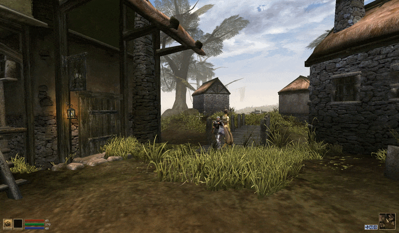
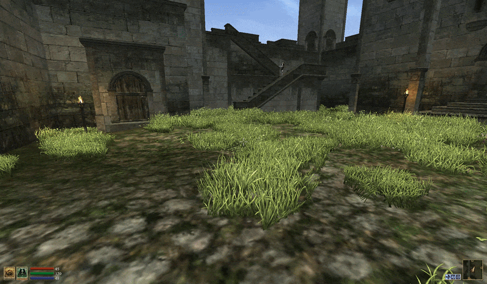
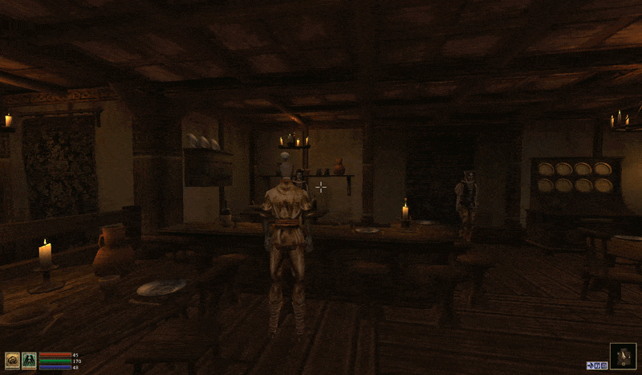
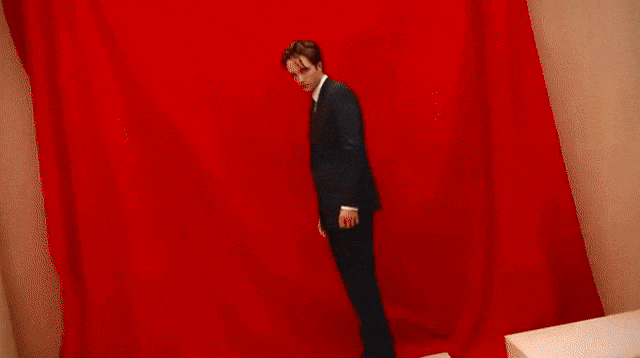

# Inventory Camera (OpenMW)

Open your inventory with style!

*Idle animations from [Dynamic Actors](https://www.nexusmods.com/morrowind/mods/54782) and head tracking.*

*Equipment updates right away!*

*Drinking animations from [Consuming Animated](https://www.nexusmods.com/morrowind/mods/59069). Third person camera moves back into its position.*

*How it feels to use this mod.*

## Requirements

Smooth Panning and Horizontal/Vertical Offset features require unpaused inventory. My unpauser of choice is [Pause Control](https://modding-openmw.gitlab.io/pause-control/).

## Compatibility

This mod is compatible with effectively anything. Treat it as a "third person camera, just in a different position".

Confirmed to be compatible with:

- [Rock the Boat](https://www.nexusmods.com/morrowind/mods/59338)
- [Devilish Alcohol Overhaul](https://www.nexusmods.com/morrowind/mods/55038) version 2.1 or newer
- [Devilish Touch of Madness](https://www.nexusmods.com/morrowind/mods/59337) version 1.9 or newer

## FAQ / Troubleshooting

### The camera freezes in place when opening inventory

This means your inventory is paused (you don't have inventory unpauser installed or enabled) and you have Smooth Panning option enabled. Either install the unpauser or disable Smooth Panning.

### Horizontal/Vertical Offset settings don't work

The same issue as the one above ^.

### The camera snaps a little at the end of the animation

This is a mod conflict on the other mods' side. Basically they might override camera rotation (usually Roll) every frame due an oversight in logic - they set it to 0 every time even when they shouldn't do anything. Check "Compatibility" section for any potential culprits.

As a temporary measure you can set each rotation value to 0 one by one to see which one is problematic (usually it's Roll). Then leave them at 0 so that they will stay the same during the camera movement and consistent with the mod that overrides them.

### The camera doesn't change its position in 3rd person while in combat/magic stance

From what I can tell, it's a conflict with a builtin OpenMW Camera lua module. Basically Inventory Camera gets overriden in those two stances. I will see if anything can be done regarding it, but I won't promise anything.

## Recommended Mods

- [Inventory Extender](https://www.nexusmods.com/morrowind/mods/59205) - Along with many wonderful things, this mod removes the paper doll. And seeing both yourself and your paper doll doesn't make much sense to me
- [Dynamic Actors](https://www.nexusmods.com/morrowind/mods/54782) and [Dynamic Animations](https://www.nexusmods.com/morrowind/mods/57633) - Enhanced idle animations
- [Consuming Animated](https://www.nexusmods.com/morrowind/mods/59069) - New animations for mundane actions
- [Voice of the Nerevarine](https://www.nexusmods.com/morrowind/mods/59486) - Banter while digging through your luggage
- [Perfect Placement](https://www.nexusmods.com/morrowind/mods/46562) - Since most of the time camera will be rotated towards you, dropping items in specific places without this mod might become an issue

## Credits

**Sosnoviy Bor** - Author  
**ownlyme** - Custom settings renderers ([Super Settings Renderers](https://www.nexusmods.com/morrowind/mods/59673))  
**SorreFalcon** - Custom settings renderers ([Sorre's Custom Renderers](https://www.nexusmods.com/morrowind/mods/59808))  
