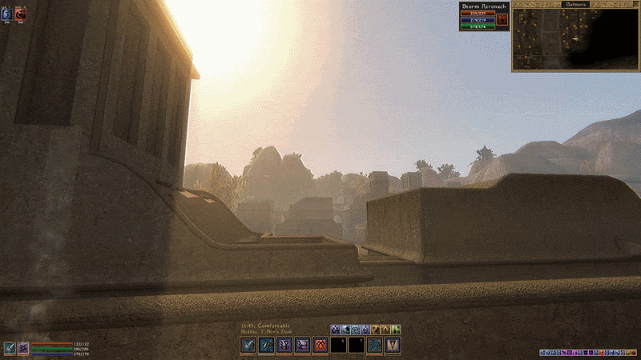
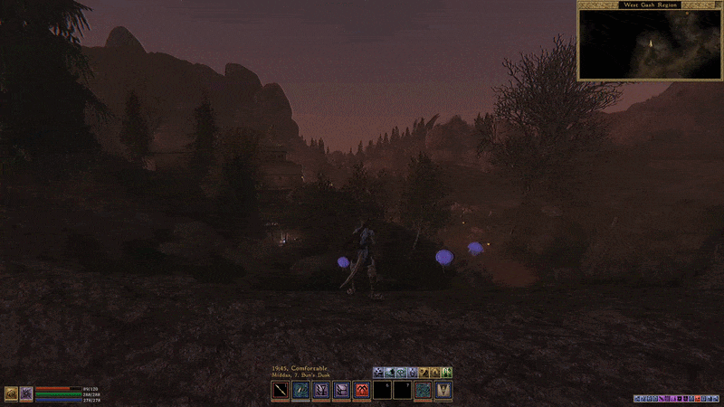
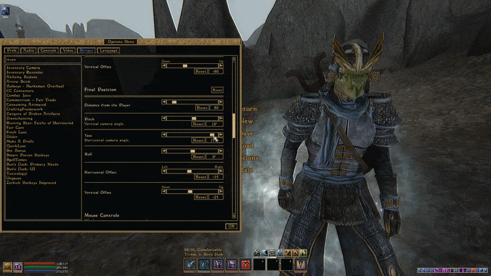
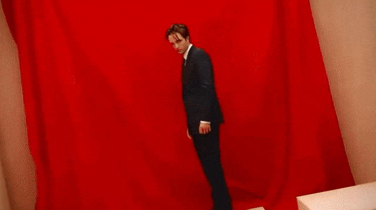

# Inventory Camera (OpenMW)

Open your inventory with style!

_Idle animations from [Dynamic Actors](https://www.nexusmods.com/morrowind/mods/54782) and head tracking._

_Equipment updates right away!_

_Drinking animations from [Consuming Animated](https://www.nexusmods.com/morrowind/mods/59069). Third person camera moves back into its position._

_How it feels to use this mod._

| **Available features**                          | **Paused** | **Unpaused** | **Notes**                        |
| :---------------------------------------------- | :--------: | :----------: | :------------------------------- |
| Smooth camera panning                           |     ✅     |      ✅      |                                  |
| Settings preview                                |     ✅     |      ✅      |                                  |
| Spotlight shader                                |     ✅     |      ✅      | Requires Post Processing enabled |
| Depth of Field shader                           |     ✅     |      ✅      | Requires Post Processing enabled |
| Mouse camera controls                           |     ✅     |      ✅      | Requires Inventory Extender      |
| Item drag and drop equipping                    |     ✅     |      ✅      | Requires Inventory Extender      |
| Item drag and drop unequipping                  |     ❌     |      ❌      | Not possible yet                 |
| Real time equipment updates                     |     ✅     |      ✅      |                                  |
| Animations                                      |     ❌     |      ✅      |                                  |
| Everything else that cannot happen during pause |     ❌     |      ✅      |                                  |

The mod does not come with inventory unpausing feature - for it you would need to install an separate mod. I personaly recommend [Unpause](https://www.nexusmods.com/morrowind/mods/60018).

## Compatibility

Should be compatible with anything.

Confirmed to be compatible with:

- [Rock the Boat](https://www.nexusmods.com/morrowind/mods/59338)
- [Red Mountain Tremors](https://www.nexusmods.com/morrowind/mods/53637)
- [Devilish Alcohol Overhaul](https://www.nexusmods.com/morrowind/mods/55038) version 2.5 or newer
- [Devilish Touch of Madness](https://www.nexusmods.com/morrowind/mods/59337) version 2.2 or newer
- [Consuming Animated](https://www.nexusmods.com/morrowind/mods/59069) version 2.0.3.1 or newer
- [Dynamic Camera](https://www.nexusmods.com/morrowind/mods/55327) - version 2.7 or newer

Load order doesn't matter.

## FAQ / Troubleshooting

### The camera snaps a little at the end of the animation

This is a mod conflict on the other mods' side. Basically they might override camera rotation every frame due an oversight in logic - they set it to 0 every time even when they shouldn't do anything. Check "Compatibility" section for any potential culprits.

As a temporary measure you can set each rotation value to 0 one by one to see which one is problematic (usually it's Roll). Then leave them at 0 so that they will stay the same during the camera movement and consistent with the mod that overrides them.

### Animations get interrupted when changing perspectives

Yes, it's a known engine feature - the same happens if you go from 1st person to 3rd too. Can't do anything about it. If it breaks some other mod - tell the mod author about it, not me.

## Recommended Mods

- [Inventory Extender](https://www.nexusmods.com/morrowind/mods/59205) - Along with many wonderful things, this mod removes the paper doll. And seeing both yourself and your paper doll doesn't make much sense to me
- [Unpause](https://www.nexusmods.com/morrowind/mods/60018) - Unpauses your inventory, allowing the game to play animations while you're in the inventory. It's more immersive this way
- [Dynamic Actors](https://www.nexusmods.com/morrowind/mods/54782) and [Dynamic Animations](https://www.nexusmods.com/morrowind/mods/57633) - Enhanced idle animations
- [Consuming Animated](https://www.nexusmods.com/morrowind/mods/59069) - New animations for mundane actions
- [Voice of the Nerevarine](https://www.nexusmods.com/morrowind/mods/59486) - Banter while digging through your luggage

## Credits

**Sosnoviy Bor** - Author  
**Max Yari and his clanker** - Code contributions (intial versions of spotlight, mouse controls and Inventory Extender integration)  
**Wareya** - Programmable Hex Depth of Field Shader  
**ownlyme** - Custom settings renderers ([Super Settings Renderers](https://www.nexusmods.com/morrowind/mods/59673))  
**SorreFalcon** - Custom settings renderers in the legacy versions of the modd ([Sorre's Custom Renderers](https://www.nexusmods.com/morrowind/mods/59808))
